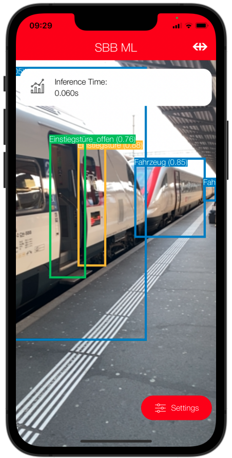

# Machine Learning for iOS

[](https://www.apple.com/ios/ios-15/)
[](https://github.com/apple/swift-package-manager)
[](https://spdx.org/licenses/MIT.html)

This framework simplifies the integration of SBB generated Core ML Object Detection models into iOS Apps using Combine. It displays a CameraStream Preview in your SwiftUI View and publishes detected objects, which you can then draw over the CameraStream preview or use for further app logic.



## Minimum supported iOS Version

* iOS 14.0

## Add the library to your project with Swift package manager

Start by adding the SBBML package to your project using Swift Package Manager.

For HTTPS:
```
https://github.com/SchweizerischeBundesbahnen/mobile-ios-ml.git
```

For SSH:
```
ssh://git@github.com:SchweizerischeBundesbahnen/mobile-ios-ml.git
```

## How to use

The main documentation (DocC) on how to use SBB ML can be created directly from the project in XCode by selecting "Product" -> "Build Documentation".

### Documentation

* DocC documentation can be created in XCode by selecting "Product" -> "Build Documentation".
* Sample app SBB ML Demo is included in Xcode project.

## Getting help

If you need help, you can reach out to us by e-mail: [mobile@sbb.ch](mailto:mobile@sbb.ch?subject=[GitHub]%20MDS%20SwiftUI)

## Getting involved

Generally speaking, we are welcoming contributions improving existing UI elements or fixing certain bugs. We will also consider contributions introducing new design elements, but might reject them, if they do not reflect our vision of SBB Design System.

General instructions on _how_ to contribute can be found under [Contributing](Contributing.md).

## Authors

* **Brunner Nicolas**

## License

Code released under the [MIT](LICENSE).
